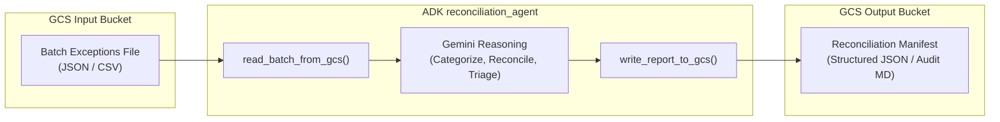

# Reconciliation Agent: Architectural Rationale & SDLC Demonstration

## Overview & Definition

The **`reconciliation_agent`** is a focused, operational agent built with the Google Agent Development Kit (ADK) that reads batched operational records from object storage (Google Cloud Storage), evaluates anomalies and discrepancies using an LLM, and writes a structured reconciliation manifest back to an output storage bucket.

### What It Is
- **An Operational Worker:** An event-driven or scheduled batch processor that reconciles transactions, events, or telemetry logs against business rules and operational policies.
- **File-Based I/O (Non-RAG):** Instead of using Cloud Storage as an unstructured knowledge base for Retrieval-Augmented Generation (RAG) with vector embeddings, the agent uses GCS for **transactional input/output boundaries** (dropzone ingestion and artifact publishing).
- **Audit-Centric:** It produces deterministic, schema-compliant summary artifacts (JSON/Markdown) that operations, compliance, or downstream automated systems can consume immediately.

---

## Real-World Industry Scenarios

Below are two enterprise scenarios illustrating how the agent operates in production environments without relying on RAG patterns.

---

### Example 1: Manufacturing (Production Line Quality & Scrap Quarantine)

#### Scenario
In a high-precision manufacturing facility, CNC milling machines and automated optical inspection (AOI) stations generate telemetry logs throughout a production shift. When machines detect anomalous tool vibrations, thermal drift, or dimensional tolerance failures, parts are rejected and a consolidated exception batch file (e.g., `gs://<env>-plant-input/lot_402_exceptions.json`) is deposited into Cloud Storage.

#### Agent Behavior
1. **Reads** the shift exception log containing sensor metrics, machine error codes, and part serial numbers.
2. **Analyzes & Correlates** failure signatures: distinguishes transient tool-wear anomalies from catastrophic calibration drift affecting entire lots.
3. **Writes** a structured lot disposition manifest (`gs://<env>-plant-output/lot_402_quarantine_manifest.json`) specifying which serial numbers require manual rework, which must be scrapped, and recommended maintenance flags for specific machines.

#### Evaluation & CI/CD Release Gating
- **Test Set:** A standardized test batch containing simulated machine errors (e.g., 10 nominal parts, 3 tool-wear warnings, 1 severe calibration failure).
- **Good Outcome (Release Proceeds):**
  - The agent identifies the calibration failure as high severity, flags all parts produced after timestamp `T` for mandatory quarantine, and outputs valid JSON matching the manufacturing execution schema.
  - The evaluation harness confirms 100% metric pass rate; CI/CD exits with status `0`; the build automatically proceeds to release.
- **Bad Outcome (Release Halts):**
  - The agent misclassifies the calibration failure as a minor warning, fails to quarantine affected serial numbers, or returns malformed JSON missing required fields (`lot_id`, `disposition`).
  - The evaluation harness catches the threshold failure and exits with status `1`; the CI pipeline fails, blocking deployment and preventing flawed quality logic from reaching production.

---

### Example 2: Healthcare Transaction Clearinghouse (Electronic Routing & Exception Triage)

#### Scenario
A nationwide health information network routes electronic transactions (such as electronic prescriptions, prior authorizations, and benefit eligibility requests) between health systems, pharmacies, and payers. While the vast majority clear in real time, malformed messages, expired provider identifiers (e.g., NPI or state license issues), and partner gateway timeouts fail transmission. These failed transactions are written into an operational dead-letter dropzone in Cloud Storage (e.g., `gs://<env>-clearinghouse-input/e-rx-transmission-exceptions-20260925.json`).

#### Agent Behavior
1. **Reads** the dead-letter exception batch from Cloud Storage.
2. **Triages & Categorizes** root causes: separates recoverable network timeouts (eligible for automated retry queues) from permanent data defects (e.g., invalid pharmacy identifier or unmapped medication codes requiring provider outreach).
3. **Writes** an auditable partner reconciliation manifest (`gs://<env>-clearinghouse-output/reconciliation_summary_20260925.json`) with triage categorizations, compliance flags, and routing instructions.

#### Evaluation & CI/CD Release Gating
- **Test Set:** A synthetic, de-identified batch containing standard electronic transaction rejections (e.g., 5 network timeouts, 2 invalid provider credential codes, and 1 malformed transaction syntax error).
- **Good Outcome (Release Proceeds):**
  - The agent categorizes transient timeouts for re-queueing and flags credential failures for partner operational follow-up. It verifies that privacy/de-identification standards are intact and outputs the exact fields required by downstream settlement queues.
  - The evaluation suite passes all assertion checks; CI pipeline finishes green; automated release proceeds to test/prod.
- **Bad Outcome (Release Halts):**
  - The agent hallucinates or classifies non-recoverable credential errors as transient timeouts (which would flood partner endpoints with invalid retry storms) or fails to produce required audit fields.
  - The test harness detects the behavioral regression, triggers a non-zero exit code, and halts the deployment pipeline immediately.

---

## What the Agent Demonstrates in the SDLC Context

While simple in code (fewer than 50 lines of agent logic), the `reconciliation_agent` was deliberately selected because it touches all critical architectural pillars of an enterprise Agent SDLC:

### 1. Infrastructure as Code (Terraform Across Environments)
- Demonstrates how cloud infrastructure for an agent is declared, versioned, and provisioned across isolated projects (`adk-sdlc`, `reconcile-agent-test`, `reconcile-agent-prod`).
- Rather than manually clicking in the Google Cloud Console, Terraform provisions dedicated input and output GCS buckets per environment with proper lifecycle policies and state management.

### 2. IAM & Principle of Least Privilege
- Teases out exact security boundaries for autonomous agents:
  - The agent's service account requires read-only permissions (`roles/storage.objectViewer`) on the input bucket.
  - The agent requires write-only permissions (`roles/storage.objectCreator`) on the output bucket.
  - Dev/Test agents have zero access to production buckets.
- Eliminates hardcoded API keys by relying on native Vertex AI authentication and workload identity across environments.

### 3. Dependent Cloud Resources (.env & Pydantic Validation)
- Provides a realistic demonstration of external dependencies without introducing excessive architectural bloat (like vector databases or multi-tier databases).
- Configuration settings (e.g., `INPUT_BUCKET_NAME`, `OUTPUT_BUCKET_NAME`, `ENVIRONMENT`) are managed via `.env` files and strictly validated at runtime using Pydantic `BaseSettings`.

### 4. Deterministic Evaluation as a CI/CD Quality Gate
- Bridges the gap between non-deterministic LLM behavior and deterministic CI/CD release engineering.
- Shows how standard ADK evaluation sets (`*.evalset.json`) run against hermetic test fixtures in an automated harness (`pytest`), producing machine-readable test reports and enforcing non-zero exit codes that physically block flawed code from shipping.
