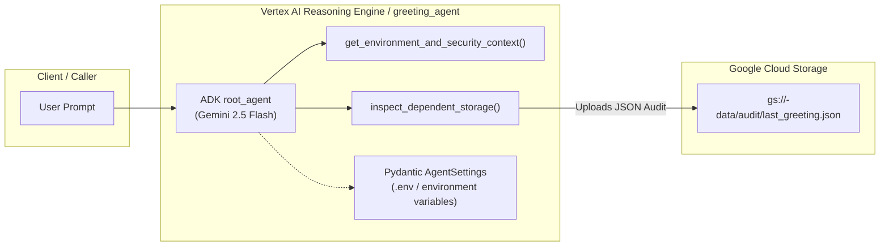
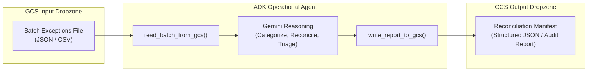

# Agent Architecture Rationale: Dependent Cloud Storage & SDLC Demonstration

## 1. Executive Summary & Architectural Rationale

When architecting a Software Development Life Cycle (SDLC) for autonomous agents built with the Google Agent Development Kit (ADK), testing and deploying pure "echo" or standalone text-in/text-out agents is insufficient to evaluate production readiness. Production-facing agents typically require:
1. **Cross-Project IAM Roles**: Autonomous workloads must authenticate and operate under strict least-privilege service accounts without public API keys.
2. **Infrastructure as Code (IaC)**: Supporting cloud resources must be provisioned and tracked across isolated environments (`test`, `prod`) using declarative Terraform.
3. **Environment-Specific Configuration**: Runtime settings must be strongly validated via Pydantic without hardcoded variables.
4. **Hermetic & Integration Evaluations**: CI/CD pipelines must gate releases using deterministic test harnesses that verify agent tool trajectories and dependent resource connectivity.

### Why File-Based Cloud Storage (Non-RAG)?
Many AI agent demonstrations default to Retrieval-Augmented Generation (RAG) with vector databases (e.g., Vertex AI Vector Search, pgvector). While RAG is valuable for unstructured document search, introducing vector indexes into a foundational SDLC reference architecture adds significant incidental complexity:
- Vector embeddings and index synchronization pipelines distract from core CI/CD release engineering.
- Vector database provisioning introduces heavy infrastructure cold-start delays and state overhead.

Instead, this architecture focuses on **file-based transactional I/O via Google Cloud Storage (GCS)**:
- **Dropzone Ingestion & Artifact Publishing**: Cloud Storage acts as a clean, deterministic boundary for operational inputs and auditable outputs.
- **Direct IAM Verification**: Calling GCS exercises Google Application Default Credentials (ADC), cross-project service account impersonation, and bucket-level IAM policies (`roles/storage.objectUser`).
- **Auditability**: Produces verifiable JSON/Markdown artifacts that CI/CD smoke tests and human operators can inspect immediately.

---

## 2. The Reference Implementation: `greeting_agent`

In this repository, the primary implementation embodying this architecture is the **`greeting_agent`** (located in [`greeting_agent/`](../greeting_agent/)):

### Key Responsibilities of `greeting_agent`:
1. **Warm Greeting & Environment Reporting**: Inspects runtime configuration (`dev`, `test`, `prod`) from Pydantic Settings.
2. **Security Context Auditing**: Surfaces active Google Cloud credentials, caller identity, target project ID, and region.
3. **Custom Configuration**: Outputs custom variables set via `.env` (such as `GREETING_BANNER`).
4. **Dependent Storage Audit**: Invokes `inspect_dependent_storage()` to connect to the project's dedicated GCS bucket (`adk-sdlc-test-01-data` or `adk-sdlc-prod-01-data`), verifying write access by recording an audit payload to `gs://<bucket>/audit/last_greeting.json`.

---

## 3. Real-World Industry Scenarios: The Reconciliation Pattern

To illustrate how this file-based operational pattern scales beyond greetings to mission-critical business workflows, consider an operational **`reconciliation_agent`** designed for transactional anomaly processing:

### Example 1: Manufacturing (Production Line Quality & Scrap Quarantine)
- **Scenario**: Automated Optical Inspection (AOI) stations on a high-precision manufacturing line reject components and deposit an hourly exception batch file (`gs://<env>-plant-data/exceptions/lot_402.json`).
- **Agent Behavior**: The agent reads the telemetry anomalies, correlates sensor signatures to distinguish transient tool-wear from catastrophic machine calibration drift, and outputs a lot disposition manifest (`gs://<env>-plant-data/quarantine/lot_402_manifest.json`) flagging parts for rework or scrap.
- **CI/CD Quality Gate**: The programmatic evaluation suite tests the agent against a synthetic batch containing known tool-wear and calibration failure modes. If the agent misclassifies severe calibration failures or outputs invalid JSON schemas, `pytest` fails with exit code `1`, halting deployment.

### Example 2: Healthcare Clearinghouse (Electronic Routing & Exception Triage)
- **Scenario**: A national health transaction network routes e-prescriptions and eligibility checks. Messages failing partner gateway timeouts or containing invalid pharmacy identifiers land in a dead-letter bucket (`gs://<env>-clearinghouse-data/dead-letter/batch_20260928.json`).
- **Agent Behavior**: The agent reads the dead-letter records, categorizes recoverable gateway timeouts (for automated re-queueing) versus malformed provider credentials (requiring partner support outreach), and writes a structured triage manifest.
- **CI/CD Quality Gate**: Pre-deployment evals verify that the agent never classifies permanent credential defects as transient retryable errors, preventing costly retry storms against upstream partner APIs.

---

## 4. What This Pattern Proves in the SDLC Context

Whether deployed as the reference `greeting_agent` or a production `reconciliation_agent`, this architecture exercises all core pillars of the Agent SDLC:

| SDLC Pillar | Architectural Implementation |
| :--- | :--- |
| **Infrastructure as Code** | Terraform provisions isolated GCS buckets (`adk-sdlc-test-01-data`, `adk-sdlc-prod-01-data`) and assigns bucket-level IAM roles declarations before agent code is packaged. |
| **Principle of Least Privilege** | Runtime service accounts (`sa-greeting-agent-test`, `sa-greeting-agent-prod`) receive only `roles/storage.objectUser` on their specific project bucket and `roles/aiplatform.user` for Gemini access. |
| **Pydantic Validation** | Configuration (`GCS_BUCKET_NAME`, `ENVIRONMENT`, `GOOGLE_CLOUD_PROJECT`) is strictly parsed and type-checked at startup, failing fast if environment variables are missing or misconfigured. |
| **Automated CI/CD Quality Gating** | ADK evaluation sets (`greeting_agent.evalset.json`) executed through `tests/test_eval_harness.py` enforce strict tool trajectory matching, ensuring breaking changes block pipeline progression. |
