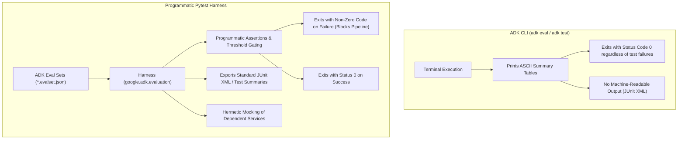

# Evaluation Harness Rationale: Why a Programmatic Harness Over the ADK CLI

## Overview

This document explains the architectural rationale for adopting a **programmatic test harness** (built on top of `pytest` and the Google Agent Development Kit's evaluation libraries) rather than invoking the raw `adk eval` or `adk test` CLI commands directly in CI/CD pipelines.

While the ADK CLI provides convenient commands for local experimentation and terminal inspection, integrating agent evaluations into an automated software development lifecycle (SDLC) requires reliability, pipeline gating, structured reporting, and environmental control that the raw CLI tools are not designed to deliver on their own.

---

## Key Drivers for Building a Programmatic Harness

### 1. Deterministic Pipeline Gating (The Exit Code Problem)

In CI/CD environments (such as automated pull request checks or build pipelines), the pipeline runner determines whether a step succeeded or failed exclusively through **process exit codes**:
- Exit code `0` = Success (allow pipeline to continue).
- Non-zero exit code (`1`, `2`, etc.) = Failure (stop pipeline, block merges, or fail build).

**The Limitation with Raw CLI:**
The `adk eval` command runs evaluations and outputs formatted console tables via standard output, but finishes execution with an exit status of `0`, even when individual evaluation cases fail or fall below the metric thresholds. In an automated pipeline, this behavior causes CI jobs to report green despite failing agent behaviors, allowing regressions to pass silently into subsequent stages.

**The Harness Solution:**
The custom harness programmatically evaluates results returned by the ADK evaluation API (`google.adk.evaluation`), inspects each `EvalCaseResult`, and executes standard test assertions. If any evaluation case fails its score threshold, the harness triggers a standard test failure and exits with code `1`, enforcing a dependable quality gate.

---

### 2. Standardized, Machine-Readable Test Reporting

Automated build systems and code hosting platforms parse standard test artifacts—most commonly **JUnit XML**—to render rich visual summaries, highlight failing test cases inline, and annotate pull requests with actionable diffs.

**The Limitation with Raw CLI:**
The CLI outputs plain text and ASCII tables (using libraries like `tabulate`) aimed at human developers reading terminal output. Parsing terminal text in automated pipelines requires brittle regex or shell scripts that break across versions.

**The Harness Solution:**
Because the harness is executed via standard test runners like `pytest`, it inherits native flags such as `--junitxml=reports/eval-results.xml`. This enables CI systems to automatically generate test dashboards, track pass/fail trends over time, and alert developers with granular failure rationales.

---

### 3. Native ADK Format Compatibility Without Schema Drift

A primary requirement of our evaluation strategy is to author and preserve test cases in standard **ADK format** (`*.evalset.json` files containing `EvalSet` and `EvalCase` structures).

**The Harness Solution:**
The harness does not reinvent test case definitions or introduce a separate format. Instead, it reads the exact same `.evalset.json` files that developers work with locally and passes them directly to the underlying ADK evaluation engine (`AgentEvaluator` and `LocalEvalService`). Developers write and maintain standard ADK eval sets, ensuring parity between local development and automated CI runs.

---

### 4. Hermetic Testing, Mocking, and Dependency Control

Production-grade agents often interact with external resources, such as object storage buckets, databases, or third-party APIs.

**The Limitation with Raw CLI:**
Running `adk eval` directly executes tools against whatever real or active credentials exist in the execution environment. In CI pipelines, invoking external services directly can introduce network flakiness, rate limits, non-deterministic state, and unnecessary cloud costs.

**The Harness Solution:**
A programmatic Python harness allows us to:
- Inject test fixtures and mock expensive or stateful tools (e.g., mocking bucket operations or database queries).
- Seed and reset test sessions deterministically between evaluations.
- Run tests hermetically inside CI containers without needing access to production or mutable infrastructure.

---

### 5. Granular Thresholds and Multi-Metric Assertions

Different agent capabilities require different validation rules:
- **Tool Selection and Trajectory:** Often requires strict 100% adherence (i.e. correct tool was called with valid parameters).
- **Instruction Following / Persona Compliance:** Evaluated using rubric scores or similarity thresholds (e.g. score $\ge 0.8$).
- **Safety and Policy Checks:** Zero-tolerance requirements.

**The Harness Solution:**
With a programmatic harness, evaluation logic is defined in code. You can assert strict equality on tool trajectories while applying tolerance ranges on semantic rubric scores, failing specifically when an individual metric drops below its acceptable threshold.

---

## Comparison Summary

| Capability | Raw ADK CLI (`adk eval`) | Programmatic Pytest Harness |
| :--- | :--- | :--- |
| **Primary Use Case** | Interactive local debugging & manual inspection | Automated CI/CD pipelines & quality gates |
| **Exit Code on Eval Failure** | Returns `0` (does not halt CI) | Returns `1` (halts CI / blocks merge) |
| **Reporting Output** | Terminal text / ASCII tables | Standard JUnit XML, JSON, and CI annotations |
| **Input Format** | Native ADK `*.evalset.json` | Native ADK `*.evalset.json` |
| **Mocking & Isolation** | Difficult / environment-dependent | Standard `unittest.mock` and `pytest` fixtures |
| **Custom Assertions** | Limited to built-in CLI flags | Fully customizable Python assertions |

---

## Conclusion

Building a lightweight harness over the ADK evaluation libraries delivers the best of both worlds: developers retain the native ADK evaluation schema for writing and organizing test cases, while the CI/CD pipeline gains deterministic pass/fail exit codes, structured reporting, and reproducible execution.
