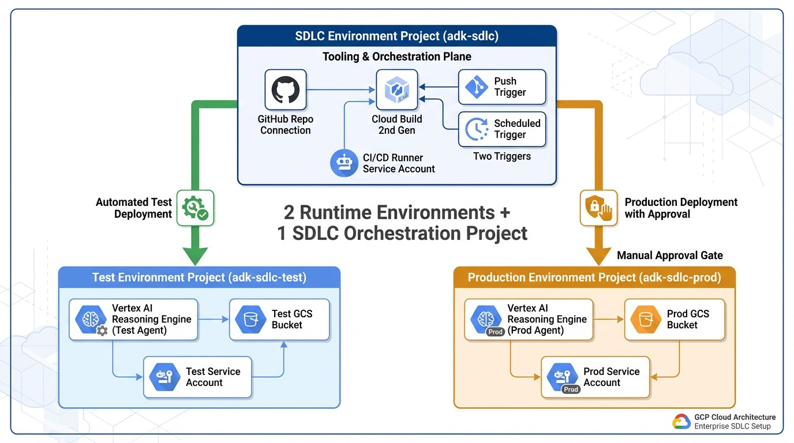

# End-to-End GCP Setup & Deployment Guide

This guide walks through deploying the entire Google Agent Development Kit (ADK) Software Development Life Cycle (SDLC) reference architecture on Google Cloud Platform from scratch.

---

## Architecture Overview

The SDLC spans three isolated GCP projects to enforce defense-in-depth, least-privilege IAM, and strict environment segregation:



```
+---------------------------------------------------------------------------------------+
|  1. CI/CD Orchestration Project: [adk-sdlc]                                           |
|  - Cloud Build 2nd Gen GitHub Connection & Repositories                               |
|  - Continuous Deployment Triggers (Automated Test & Manual Approval Prod)             |
|  - Dedicated CI/CD Service Account: sa-adk-cicd-runner@adk-sdlc.iam.gserviceaccount.com|
+---------------------------------------------------------------------------------------+
                    |                                       |
    (Automatic Push to main)                  (Manual Approval Required)
                    v                                       v
+---------------------------------------+   +---------------------------------------+
|  2. Test Project: [adk-sdlc-test-01]  |   |  3. Prod Project: [adk-sdlc-prod-01]  |
|  - Gemini Enterprise Agent Runtime    |   |  - Gemini Enterprise Agent Runtime    |
|  - Dependent GCS Bucket               |   |  - Dependent GCS Bucket               |
|  - Least-privilege Test SA            |   |  - Least-privilege Prod SA            |
+---------------------------------------+   +---------------------------------------+
```

---

## Workflow Overview

The end-to-end setup and deployment workflow follows this sequence:

```
[GCP Projects & APIs] ──> [GitHub Connection]
                                │
                                ▼
[1. Virtual Env Setup] ──> [2. Config (.env)] ──> [3. GCP Auth]
                                                         │
                                                         ▼
[7. Verify Endpoint] <── [6. Run Evals] <── [5. Deploy Agent] <── [4. Terraform Infra]
```

> [!NOTE]
> **Does the eval script deploy the agent?**  
> **No.** The evaluation harness (`tests/test_eval_harness.py`) runs hermetically in-memory using ADK's `Runner` and `InMemorySessionService` against Gemini on Vertex AI. It evaluates tool trajectories, security contexts, and output assertions without deploying any resources. Deployment is a separate step handled by `scripts/deploy_agent.sh` or automated Cloud Build pipelines.

---

## Prerequisites

1. **Google Cloud CLI (`gcloud`)** installed:
   ```bash
   gcloud --version
   ```
2. **Terraform** (>= 1.5.0) installed:
   ```bash
   terraform -version
   ```
3. **`uv` Package Manager** installed:
   ```bash
   curl -LsSf https://astral.sh/uv/install.sh | sh
   ```
4. **Python 3.12** installed.
5. **Active Google Cloud Billing Account**.

---

## Phase 0: GCP Project Initialization & GitHub Connection

### 0.1 Project Creation & Billing Association

Define your environment variables and associate billing across all three projects:

```bash
export BILLING_ACCOUNT_ID="YOUR_BILLING_ACCOUNT_ID"
export CI_PROJECT_ID="adk-sdlc-99"
export TEST_PROJECT_ID="adk-sdlc-test-99"
export PROD_PROJECT_ID="adk-sdlc-prod-99"
export REGION="us-central1"

# Create CI/CD Orchestration Project
gcloud projects create "${CI_PROJECT_ID}" --name="ADK CI/CD"
gcloud billing projects link "${CI_PROJECT_ID}" --billing-account="${BILLING_ACCOUNT_ID}"

# Create Test Project
gcloud projects create "${TEST_PROJECT_ID}" --name="ADK Test"
gcloud billing projects link "${TEST_PROJECT_ID}" --billing-account="${BILLING_ACCOUNT_ID}"

# Create Production Project
gcloud projects create "${PROD_PROJECT_ID}" --name="ADK Prod"
gcloud billing projects link "${PROD_PROJECT_ID}" --billing-account="${BILLING_ACCOUNT_ID}"
```

### 0.2 Enable Required GCP APIs

Enable the required services across all three projects:

```bash
SERVICES=(
  aiplatform.googleapis.com
  cloudbuild.googleapis.com
  storage.googleapis.com
  iam.googleapis.com
  logging.googleapis.com
  serviceusage.googleapis.com
)

for PROJECT in "${CI_PROJECT_ID}" "${TEST_PROJECT_ID}" "${PROD_PROJECT_ID}"; do
  echo "Enabling APIs on ${PROJECT}..."
  gcloud services enable "${SERVICES[@]}" --project="${PROJECT}"
done
```

### 0.3 Configure Cloud Build 2nd Gen GitHub Connection

> [!TIP]
> **Console Recommended**: It is significantly easier and faster to configure the GitHub Host Connection and link the repository **manually in the Google Cloud Console**, because it requires interactive browser-based OAuth authorization with GitHub.

Follow these steps in the Google Cloud Console:
1. In your **CI/CD Project** (`${CI_PROJECT_ID}`), navigate to **Cloud Build** -> **Repositories (2nd gen)**.
2. Click **Create Host Connection**:
   - Provider: **GitHub**
   - Connection name: `github-connection-001` (Region: `us-central1`)
   - Authorize and install the Google Cloud Build GitHub App on your GitHub account/organization.
3. Once the host connection is created, click **Link Repository**:
   - Connection: `github-connection-001`
   - Select your repository (e.g. `your-username/adk-sdlc`).

---

## 1. Clone & Set Up Python Virtual Environment

Clone the repository and initialize a virtual environment using `uv`:

```bash
git clone https://github.com/<your-username>/adk-sdlc.git
cd adk-sdlc

# Create hermetic virtual environment using Python 3.12
uv venv .venv --python 3.12

# Activate virtual environment
source .venv/bin/activate

# Synchronize pinned project dependencies
uv sync
```

---

## 2. Configure Local Application Environment (`.env`)

Configuration is managed via strongly-typed Pydantic settings ([`greeting_agent/config.py`](../greeting_agent/config.py)). Follow the workable template pattern:

```bash
# Copy the sanitized template to active local .env
cp .env.example .env

# Create a symbolic link so the greeting_agent package reads root settings
ln -sf ../.env greeting_agent/.env
```

Customize `.env` with your active project settings:
```bash
ENVIRONMENT=dev
GOOGLE_CLOUD_PROJECT=adk-sdlc-test-99
GOOGLE_CLOUD_LOCATION=us-central1
LLM_MODEL=gemini-3.8-flash
GOOGLE_GENAI_USE_VERTEXAI=true
GOOGLE_GENAI_USE_ENTERPRISE=true
GREETING_BANNER="Local Development Banner"
GCS_BUCKET_NAME=adk-sdlc-test-99-data
```

> [!NOTE]
> `.env` is explicitly ignored by [`.gitignore`](../.gitignore), ensuring active project IDs and secrets are never committed to version control.

---

## 3. Authenticate with Google Cloud

Authenticate your interactive user and generate Application Default Credentials (ADC) for Vertex AI and Cloud Storage access:

```bash
# Authenticate gcloud CLI
gcloud auth login

# Generate Application Default Credentials for the Python SDK
gcloud auth application-default login
```

Verify the active credentials:
```bash
gcloud auth list
```

---

## 4. Environment Setup (Terraform)

Terraform manages all non-release infrastructure: dependent GCS storage buckets, dedicated service accounts, cross-project IAM roles, and Cloud Build triggers. Infrastructure state is isolated across distinct directories and backends to prevent cross-environment state mutation and unintended side effects (see [Terraform Architecture & State Management](terraform-architecture.md)).

Each environment directory uses `terraform.tfvars.example` and `backend.tfvars.example` templates, keeping active credentials and bucket configurations out of version control.

### Step 4.1: Bootstrap Remote State Storage
Provisions the centralized Cloud Storage bucket for Terraform remote state with Uniform Bucket-Level Access and Object Versioning:

```bash
./scripts/bootstrap_terraform_state.sh "${CI_PROJECT_ID}" "${REGION}" "${CI_PROJECT_ID}-terraform-state"
```
*(Alternatively, navigate to `terraform/bootstrap`, populate `terraform.tfvars`, and run `terraform init && terraform apply`).*

### Step 4.2: Stand Up Test Environment
Provisions test project APIs, dedicated test GCS bucket, and runtime service account:

```bash
cd terraform/environments/test
cp terraform.tfvars.example terraform.tfvars     # Populate test_project_id
cp backend.tfvars.example backend.tfvars         # Populate bucket name
terraform init -backend-config=backend.tfvars
terraform apply -auto-approve
```

### Step 4.3: Stand Up Production Environment
Provisions production project APIs, dedicated prod GCS bucket, and runtime service account:

```bash
cd ../prod
cp terraform.tfvars.example terraform.tfvars     # Populate prod_project_id
cp backend.tfvars.example backend.tfvars         # Populate bucket name
terraform init -backend-config=backend.tfvars
terraform apply -auto-approve
```

### Step 4.4: Stand Up CI/CD Pipelines & Cross-Project IAM
Provisions the Cloud Build runner service account, cross-project deployment IAM roles, and automated triggers:

```bash
cd ../cicd
cp terraform.tfvars.example terraform.tfvars     # Populate project IDs and GitHub repo
cp backend.tfvars.example backend.tfvars         # Populate bucket name
terraform init -backend-config=backend.tfvars
terraform apply -auto-approve
cd ../../..
```

---

## 5. Deploy the Agent

### Method A: Manual / Local CLI Deployment
Deploy directly to the test project using the unified deployment script:

```bash
./scripts/deploy_agent.sh "${TEST_PROJECT_ID}" "${REGION}" "test" "${TEST_PROJECT_ID}-data"
```

The [`scripts/deploy_agent.sh`](../scripts/deploy_agent.sh) script automatically:
1. Prepares stage-specific `.env` configuration.
2. Checks Vertex AI for an existing Reasoning Engine ID (`scripts/get_agent_id.py`).
3. Executes an **in-place update** if an ID exists (preserving endpoint IDs for downstream consumers) or creates a fresh deployment.
4. Invokes `adk deploy agent_engine`.
5. Runs post-deployment live verification.

### Method B: Automated CI/CD Pipeline (Cloud Build)
Push changes to the `main` branch:

```bash
git add .
git commit -m "feat: deploy greeting agent via automated pipeline"
git push origin main
```

- **Test Pipeline (`cloudbuild-test.yaml`)**: Runs automatically on push, executes the programmatic evaluation quality gate, and deploys to `adk-sdlc-test-01`.
- **Production Pipeline (`cloudbuild-prod.yaml`)**: Triggers on push, executes quality gating, and pauses in `PENDING_APPROVAL`. Once approved by a release manager in the Cloud Build Console, it deploys in-place to `adk-sdlc-prod-01`.

---

## 6. Run the Programmatic Evaluation Suite

Execute the 5-case evaluation test harness:

```bash
uv run pytest tests/test_eval_harness.py -v --junitxml=reports/eval-results.xml
```

### Evaluation Cases Evaluated:
- **`eval_01_environment_and_greeting`**: Validates warm greeting and environment recognition.
- **`eval_02_security_context_inspection`**: Audits caller identity and service account principal.
- **`eval_03_custom_env_variable`**: Asserts custom banner propagation via Pydantic.
- **`eval_04_dependent_storage_audit`**: Verifies dependent Cloud Storage connectivity.
- **`eval_05_comprehensive_status_report`**: Validates multi-tool invocation trajectory.

> [!NOTE]
> All 5 cases run against the in-memory agent runner. Any failure raises an assertion error causing `pytest` to exit with code `1`, reliably blocking CI/CD pipelines before any broken release can reach production.

---

## 7. Post-Deployment Verification & Interactive Testing

### Verify Deployed Reasoning Engine Endpoint
Run the live smoke verification script against the deployed Vertex AI endpoint:

```bash
# Retrieve active Reasoning Engine resource ID
AGENT_ID=$(uv run python scripts/get_agent_id.py --project="${TEST_PROJECT_ID}" --region="${REGION}" --display_name="greeting_agent")

# Verify endpoint responsiveness
uv run python scripts/verify_agent_api.py --project="${TEST_PROJECT_ID}" --region="${REGION}" --agent_id="${AGENT_ID}"
```

### Interactive Local Browser UI
Launch the ADK interactive browser UI for manual local prompt testing:

```bash
uv run adk web greeting_agent
```
