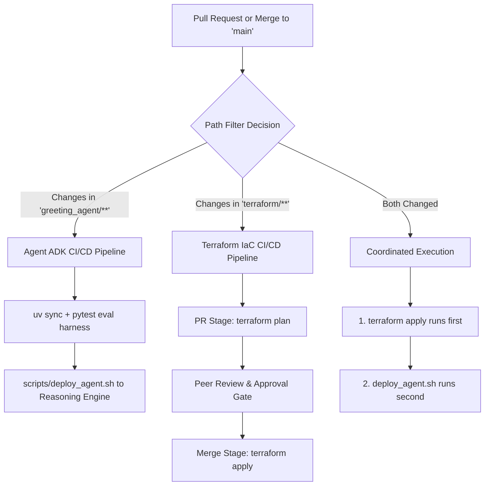

# Terraform State Management & Infrastructure Architecture

This document describes how Infrastructure as Code (IaC) and Terraform state are architected, isolated, secured, and bootstrapped in the Google Agent Development Kit (ADK) Software Development Life Cycle (SDLC) reference architecture.

---

## 1. Executive Summary & Design Principles

In a production ADK environment spanning multiple Google Cloud projects, infrastructure is categorized into two distinct lifecycles:

1. **Foundational Infrastructure (Managed by Terraform)**:
   - Long-lived resources that outlive individual application code pushes.
   - Enabled Google Cloud APIs (`aiplatform`, `cloudbuild`, `storage`, `iam`, `logging`).
   - Dependent Cloud Storage buckets (e.g. `adk-sdlc-test-01-data` and `adk-sdlc-prod-01-data`).
   - Dedicated runtime Service Accounts with Least-Privilege IAM role bindings.
   - Cloud Build 2nd generation GitHub connections and continuous deployment triggers.
2. **Application Release Lifecycle (Managed by CI/CD & Shell Automation)**:
   - Vertex AI Reasoning Engine / Agent Engine containers, model configurations, in-place updates, and live smoke tests (handled via [`scripts/deploy_agent.sh`](../scripts/deploy_agent.sh) and [`cloudbuild-*.yaml`](../cloudbuild-test.yaml)).

To manage foundational infrastructure safely, this repository enforces **four core state management tenets**:
- **Tenet 1: Zero State in Version Control**: Local state files and sensitive variables are barred from Git via [`.gitignore`](../.gitignore).
- **Tenet 2: Remote GCS Backend with Native State Locking**: State is stored in Google Cloud Storage, which natively enforces object locking, concurrency prevention, and encryption at rest.
- **Tenet 3: State File Isolation by Environment & Layer**: Test, Production, and CI/CD pipelines maintain distinct remote state files with separate prefixes, preventing accidental cross-environment state mutation or resource deletion.
- **Tenet 4: Deterministic Backend Bootstrapping**: A dedicated bootstrap layer solves the "chicken-and-egg" dilemma of creating the state storage bucket before running Terraform.

---

## 2. Directory Structure & Architecture

The repository separates reusable resource modules from state-isolated environment configurations:

```text
terraform/
├── README.md                            # Quickstart guide for operators
├── bootstrap/                           # Bootstrap module for state storage bucket
│   ├── main.tf                          # GCS state bucket with versioning & UBLA
│   ├── variables.tf                     # Configurable bucket name, project, region
│   ├── outputs.tf                       # State bucket name & URL
│   └── versions.tf                      # Terraform & Google provider constraints
├── modules/                             # Shared, reusable Terraform modules
│   ├── agent_environment/               # Encapsulates an ADK agent environment
│   │   ├── main.tf                      # APIs, GCS bucket, runtime SA, IAM bindings
│   │   ├── variables.tf                 # project_id, environment, region, agent_name
│   │   └── outputs.tf                   # bucket_name, agent_sa_email, project_id
│   └── cicd_pipeline/                   # Encapsulates Cloud Build CI/CD runner & triggers
│       ├── main.tf                      # Runner SA, cross-project IAM, CB triggers
│       ├── variables.tf                 # cloud_build_project_id, test/prod IDs & buckets
│       └── outputs.tf                   # runner_sa_email, test_trigger_id, prod_trigger_id
└── environments/                        # State-isolated root modules
    ├── test/                            # Isolated Test environment
    │   ├── main.tf                      # Instantiates agent_environment for 'test'
    │   ├── variables.tf                 # test_project_id, region, agent_name
    │   ├── outputs.tf                   # test outputs
    │   └── versions.tf                  # Remote backend prefix: environments/test
    ├── prod/                            # Isolated Production environment
    │   ├── main.tf                      # Instantiates agent_environment for 'prod'
    │   ├── variables.tf                 # prod_project_id, region, agent_name
    │   ├── outputs.tf                   # prod outputs
    │   └── versions.tf                  # Remote backend prefix: environments/prod
    └── cicd/                            # Isolated CI/CD orchestration layer
        ├── main.tf                      # Instantiates cicd_pipeline module
        ├── variables.tf                 # CI/CD project, GitHub repo connection, test/prod IDs
        ├── outputs.tf                   # trigger IDs and runner SA
        └── versions.tf                  # Remote backend prefix: environments/cicd
```

---

## 3. The 4 Tenets of State Management

### Tenet 1: Zero State in Version Control

Terraform state files (`.tfstate`) contain metadata about every managed resource and frequently include sensitive values in cleartext.

The repository's [`.gitignore`](../.gitignore) strictly bars local state and variables:
```gitignore
# --- Terraform & CI Reports ---
.terraform/
*.tfstate
*.tfstate.*
*.tfvars
```
Meanwhile, the dependency lockfiles (`.terraform.lock.hcl`) inside modules and environments **are tracked in Git** to guarantee reproducible provider plugin versions across all developer workstations and CI runners.

### Tenet 2: Remote GCS Backend with Native State Locking

Every environment under `terraform/environments/` uses the Google Cloud Storage (`gcs`) backend:

```hcl
terraform {
  required_version = ">= 1.5.0"
  required_providers {
    google = {
      source  = "hashicorp/google"
      version = "~> 6.0"
    }
  }

  backend "gcs" {
    bucket = "adk-sdlc-terraform-state"
    prefix = "environments/test" # Distinct prefix per environment
  }
}
```

#### Why GCS for State?
1. **Native Concurrency Locking**: GCS utilizes strong read-after-write consistency and preconditions (generation matches) to lock state during `terraform plan` and `terraform apply`. Unlike AWS (which traditionally requires a separate DynamoDB table for locking), GCS handles locking natively without additional infrastructure.
2. **Encryption at Rest**: Google Cloud automatically encrypts all storage bucket contents using Google-managed encryption keys (or customer-managed Cloud KMS keys).
3. **Auditability**: Access to the state bucket is logged in Google Cloud Audit Logs.

### Tenet 3: State File Isolation by Environment & Layer

#### The Monolithic State Problem
In a single monolithic state file, all resources across Test, Production, and CI/CD are grouped together. This introduces significant operational risks:
- **Cross-Environment Impact**: A typo or syntax error when planning changes in Test could accidentally modify or destroy Production resources.
- **Lock Contention**: An engineer running a plan against Test locks the state file, preventing CI/CD from applying a critical release in Production.
- **Overprivileged Credentials**: The operator running Terraform needs administrator permissions across all three projects simultaneously.

#### The Isolated State Solution
By partitioning state into distinct directories under `terraform/environments/`:

```
gs://adk-sdlc-terraform-state/
├── environments/
│   ├── test/default.tfstate     <-- Manages ONLY Test project resources
│   ├── prod/default.tfstate     <-- Manages ONLY Prod project resources
│   └── cicd/default.tfstate     <-- Manages CI/CD triggers & cross-project IAM
```

| Environment | State Prefix | Target Project | Impact Scope |
| :--- | :--- | :--- | :--- |
| **`environments/test`** | `environments/test` | `adk-sdlc-test-01` | Test bucket, Test agent SA, Test APIs |
| **`environments/prod`** | `environments/prod` | `adk-sdlc-prod-01` | Prod bucket, Prod agent SA, Prod APIs |
| **`environments/cicd`** | `environments/cicd` | `adk-sdlc` | Cloud Build triggers, CI runner SA, cross-project roles |

### Tenet 4: Deterministic Backend Bootstrapping

#### The "Chicken-and-Egg" Problem
Terraform requires a GCS bucket to store remote state. However, if Terraform is used to create all infrastructure, who creates the GCS bucket for Terraform's state?

#### The Solution: Two Supported Workflows
This repository provides two clean patterns to resolve the bootstrap paradox:

1. **Automated CLI Bootstrap (Recommended)**:
   A dedicated automation script ([`scripts/bootstrap_terraform_state.sh`](../scripts/bootstrap_terraform_state.sh)) creates the bucket idempotently with required security controls before any Terraform command is run:
   ```bash
   ./scripts/bootstrap_terraform_state.sh "adk-sdlc" "us-central1" "adk-sdlc-terraform-state"
   ```
   This script:
   - Validates Google Cloud authentication.
   - Enables `storage.googleapis.com` on the host project.
   - Creates `gs://<bucket-name>` with Uniform Bucket-Level Access (UBLA) and Public Access Prevention.
   - Enables Object Versioning for disaster recovery.

2. **Dedicated Bootstrap Module (`terraform/bootstrap`)**:
   For organizations mandating that even state buckets be declared in Terraform:
   ```bash
   cd terraform/bootstrap
   terraform init    # Runs using local state
   terraform apply   # Creates the GCS bucket
   ```
   Once created, the bootstrap state can optionally be migrated into the newly created bucket (`terraform init -migrate-state`).

---

## 4. Disaster Recovery & Rollback Strategy

Accidental state corruption or misapplied configurations can halt deployments. This architecture implements multiple layers of disaster recovery:

### 1. Object Versioning on State Bucket
Object versioning is enforced on the GCS state bucket:
```bash
gcloud storage buckets describe gs://adk-sdlc-terraform-state --format="yaml(versioning)"
```
Every time `terraform apply` writes a new state file, the previous state is preserved as a non-current object version.

### 2. State Rollback Procedure
If a catastrophic state corruption occurs:
1. List previous state versions:
   ```bash
   gcloud storage objects list gs://adk-sdlc-terraform-state/environments/test/ --versions
   ```
2. Copy the previous healthy generation over the live state:
   ```bash
   gcloud storage cp gs://adk-sdlc-terraform-state/environments/test/default.tfstate#<GENERATION_ID> \
     gs://adk-sdlc-terraform-state/environments/test/default.tfstate
   ```
3. Run `terraform refresh` in the target environment directory to reconcile state with live cloud infrastructure.

### 3. State Lifecycle Policy
To prevent infinite storage cost accumulation while maintaining safety, [`terraform/bootstrap/main.tf`](../terraform/bootstrap/main.tf) enforces an automated lifecycle rule: non-current state versions older than 90 days with more than 5 newer versions are safely purged.

---

## 5. Operator Runbook: Step-by-Step Provisioning

### Step 1: Bootstrap Remote State
Run the bootstrap script from the repository root:
```bash
./scripts/bootstrap_terraform_state.sh "adk-sdlc" "us-central1" "adk-sdlc-terraform-state"
```

### Step 2: Provision Test Environment
```bash
cd terraform/environments/test
terraform init
terraform plan -out=test.tfplan
terraform apply test.tfplan
```
*Outputs: `test_bucket_name`, `test_agent_service_account`, `test_project_id`.*

### Step 3: Provision Production Environment
```bash
cd ../prod
terraform init
terraform plan -out=prod.tfplan
terraform apply prod.tfplan
```
*Outputs: `prod_bucket_name`, `prod_agent_service_account`, `prod_project_id`.*

### Step 4: Provision CI/CD Pipeline & Triggers
```bash
cd ../cicd
terraform init
terraform plan -out=cicd.tfplan
terraform apply cicd.tfplan
cd ../../..
```
*Outputs: `cloudbuild_service_account`, `test_trigger_id`, `prod_trigger_id`.*

---

## 6. Verification & State Inspection Commands

To inspect the state of any individual environment without disturbing other environments:

```bash
# Inspect resources in the Test environment
cd terraform/environments/test
terraform state list
terraform show

# Check state lock status
terraform refresh
```

---

## 7. Summary Comparison

| Dimension | Legacy Monolithic Terraform | Modular & State-Isolated Terraform (Current Architecture) |
| :--- | :--- | :--- |
| **State Storage** | Single shared `default.tfstate` | Isolated state files per environment (`test`, `prod`, `cicd`) |
| **Cross-Environment Impact** | High — mistakes in test can modify prod resources | Minimized — environments are decoupled across distinct state files |
| **Locking Contention**| Frequent — concurrent runs block each other | None — independent lock per environment |
| **Bootstrapping** | Manual, ad-hoc CLI steps | Automated script + dedicated `terraform/bootstrap` module |
| **Module Reusability**| Duplicate resource definitions | Shared [`modules/agent_environment`](../terraform/modules/agent_environment) & [`modules/cicd_pipeline`](../terraform/modules/cicd_pipeline) |

---

## 8. Enterprise Evolution: Graduating to CI/CD Automation (Pattern A)

While this repository intentionally maintains an **ADK-centric focus**—emphasizing agent evaluation harnesses, `uv` dependency hermeticity, and Vertex AI Reasoning Engine deployments—mature enterprise environments often automate Terraform execution rather than relying on manual operator CLI steps.

The recommended architectural approach for this repository structure is **Pattern A: Path-Triggered Dual Pipelines**.



### 1. Trigger Structure

Implementing Pattern A requires adding two path-filtered triggers for infrastructure and scoping existing agent triggers:

| Trigger Name | Event Source | Included Files (`included_files`) | Action / Target Build |
| :--- | :--- | :--- | :--- |
| **`deploy-test-pipeline`** *(Existing)* | Push to `main` | `["greeting_agent/**", "tests/**", "scripts/**"]` | Runs `cloudbuild-test.yaml` (eval harness + Reasoning Engine deployment) |
| **`deploy-prod-pipeline`** *(Existing)* | Push to `main` (Approved) | `["greeting_agent/**", "tests/**", "scripts/**"]` | Runs `cloudbuild-prod.yaml` (prod eval harness + prod deployment) |
| **`tf-plan-on-pr`** *(New)* | Pull Request to `main` | `["terraform/**"]` | Runs `terraform plan` for `test` and `prod`, posting plan output to PR checks |
| **`tf-apply-on-merge`** *(New)* | Push (Merge) to `main` | `["terraform/**"]` | Runs `terraform apply -auto-approve` (with Cloud Build approval gate for `prod`) |

### 2. Example Cloud Build Configuration for Terraform (`cloudbuild-terraform.yaml`)

```yaml
steps:
  - name: 'hashicorp/terraform:1.9'
    id: 'tf-init-plan-test'
    dir: 'terraform/environments/test'
    entrypoint: 'sh'
    args:
      - '-c'
      - |
        terraform init
        terraform plan -no-color -out=test.tfplan

  - name: 'hashicorp/terraform:1.9'
    id: 'tf-apply-test'
    dir: 'terraform/environments/test'
    entrypoint: 'sh'
    args:
      - '-c'
      - |
        # Only executed during push/merge to main (not during speculative PR checks)
        if [ "$_APPLY" = "true" ]; then
          terraform apply -auto-approve test.tfplan
        fi

substitutions:
  _APPLY: 'false'
options:
  logging: CLOUD_LOGGING_ONLY
```

### 3. Key Benefits of Keeping Agent & Infra Pipelines Decoupled

* **Fast Iteration for Prompt & Tool Developers:** Modifying prompts or logic in `greeting_agent/` triggers rapid eval runs and Vertex AI deployments without paying the latency or risk overhead of running a full Terraform state refresh.
* **Scope of Impact Containment:** Infrastructure and IAM modifications follow a stricter review cycle (`terraform plan` audit) before affecting runtime service accounts or Cloud Storage buckets.
* **Deterministic Dependencies:** When an agent update requires a new GCP resource (e.g., a new Datastore index, GCS bucket, or IAM role), the Terraform apply runs first, ensuring the required infrastructure is active before the agent runtime calls the new API.

